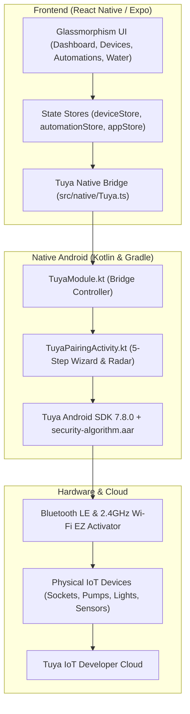

# Smart CodeFlurry — Mobile IoT & Universal Device Automation Platform

A production-grade mobile IoT control, water infrastructure monitoring, and universal device automation platform built with **React Native (Expo SDK 52)**, **TypeScript**, a custom **Kotlin Native Bridge**, and the **Tuya IoT Android SDK 7.8.0**.

---

## 🌟 Key Capabilities

### 1. Universal Smart Life 5-Step Device Pairing Wizard
- **Automated Mobile Network Detection**: Automatically locks onto your phone's active 2.4 GHz Wi-Fi (`Airtel_VivaanGowda`) and remembers network credentials securely via `SharedPreferences`.
- **Dynamic 5-Step Wizard tailored for ALL device types**:
  - **Step 1 (Power Cycle)**: Dynamic illustration and power-on guide.
  - **Step 2 (Reset Action)**: Hardware-specific reset steps (e.g. *Hold RESET 5s* for sockets/pumps, *ON-OFF-ON-OFF-ON* for lights, *Pin-hole reset* for sensors).
  - **Step 3 (Confirm Blinking)**: Hardware signal indicator check.
  - **Step 4 (Connecting Device)**: Animated device glow + smooth linear progress bar (0%–100%) with background UDP broadcast and BLE GATT token exchange.
  - **Step 5 (Result Screen)**: Instant success confirmation or retry/troubleshoot options.
- **Active BLE Radar Scanner**: Background Bluetooth scan banner with 1-tap instant add.

### 2. Autonomous Water & Irrigation Management
- Real-time telemetry monitoring for **Borewell**, **Sump (65%)**, and **Overhead Tank (18% Low)**.
- **Pump Safety & Dry-Run Interlocks**: Automatically prevents pump operation if the water source is below minimum safety thresholds.
- Dedicated schematics and pump starter controls for Borewell Starter, Tank Transfer Pump, and Irrigation Line Valves.

### 3. Event-Driven Automation Engine
- Multi-condition trigger evaluation (`AND` / `OR` logic).
- Time-of-day schedules, sensor threshold triggers, and device state events.
- In-app **Automation Builder Modal** for creating, editing, and toggling automated rules.

### 4. Warm Charcoal Glassmorphism UI
- Fully implemented custom design system:
  - **Background**: `#1E1B19`
  - **Surface**: `#2A2725`
  - **Primary Accent**: Soft Warm Orange (`#FF8A50`)
  - **Accents**: Emerald Green (`#6BCB8C`), Sky Blue (`#1E88E5`)

---

## 🛠️ Architecture & Tech Stack



- **Frontend**: React Native 0.76.7, Expo 52, TypeScript 5.3
- **State Management**: Zustand Stores
- **Native Android**: Kotlin 1.9+, Java 17/21 (JBR)
- **IoT Engine**: Tuya Smart Home SDK 7.8.0, `security-algorithm-1.0.0-beta.aar`

---

## 🚀 Build & Run Instructions

### Prerequisites
- Node.js 18+ & npm
- Android Studio with Android SDK 34/35 & JBR 17/21
- Connected Android physical test device (or Android Emulator) with USB Debugging enabled

### 1. Install Dependencies
```bash
npm install
```

### 2. Run in Development Mode
```bash
npx expo start
```

### 3. Build & Install Release APK
```powershell
# Set Java Home to Android Studio JBR
$env:JAVA_HOME = "C:\Program Files\Android\Android Studio\jbr"
$env:PATH = "$env:JAVA_HOME\bin;$env:PATH"

# Navigate to android folder
cd android

# Assemble release APK
.\gradlew.bat assembleRelease --no-daemon

# Install onto connected phone via ADB
adb install -r -d "app/build/outputs/apk/release/app-release.apk"
```

---

## 🔑 Tuya Platform Configuration

- **Package Name**: `com.smartcodeflurry.app`
- **Tuya AppKey**: `cth5newsmcfjsk3kgn4`
- **Tuya AppSecret**: `xaestahcng8hayjvptc37c488jyxv35n`
- **Registered SHA-256 Fingerprint**: `FA:C6:17:45:DC:09:03:78:6F:B9:ED:E6:2A:96:2B:39:9F:73:48:F0:BB:6F:89:9B:83:32:66:75:91:03:3B:9C`

---

## 📂 Project Directory Structure

```
├── android/                    # Android native project & Gradle config
│   ├── app/
│   │   ├── libs/               # Official Tuya security-algorithm AAR
│   │   ├── src/main/
│   │   │   ├── assets/         # Tuya SDK configuration & font assets
│   │   │   └── java/.../tuya/  # TuyaModule.kt, TuyaPairingActivity.kt
├── app/                        # Expo Router tab screens
│   ├── (tabs)/
│   │   ├── index.tsx           # Home Dashboard screen
│   │   ├── devices.tsx         # Devices list & + Add Device entry
│   │   ├── automations.tsx     # Automations screen & builder modals
│   │   ├── water.tsx           # Water infrastructure & pump control
│   │   └── more.tsx            # Profile & settings
├── src/
│   ├── components/             # Glassmorphism cards, buttons, tabs & badges
│   ├── data/mock/              # Seed data for automations and water telemetry
│   ├── models/                 # TypeScript interfaces (device, automation, water)
│   ├── native/                 # TypeScript bridge to native Tuya module
│   ├── store/                  # Zustand stores (deviceStore, automationStore, etc.)
│   └── design/                 # Color tokens, typography, and spacing
└── package.json
```

---

## 📄 License & Ownership
Copyright © 2026 Smart CodeFlurry / IoTNexus. All rights reserved.
